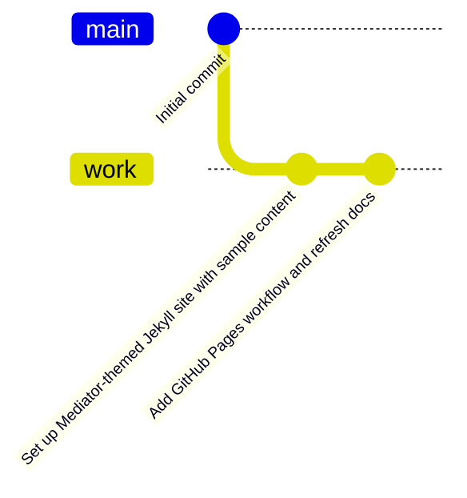
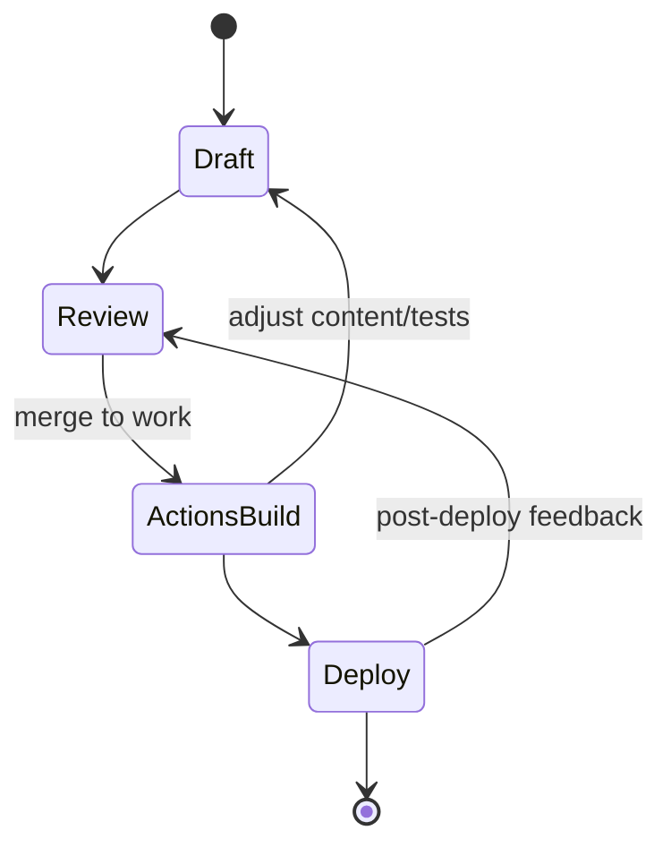
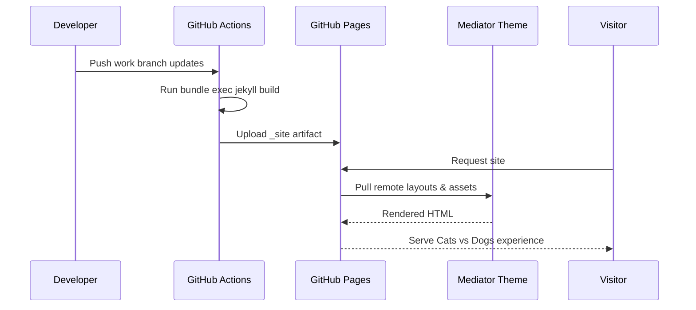
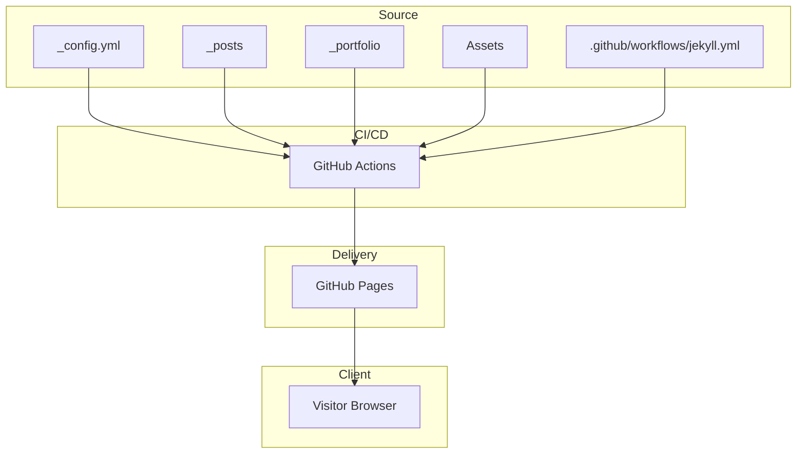
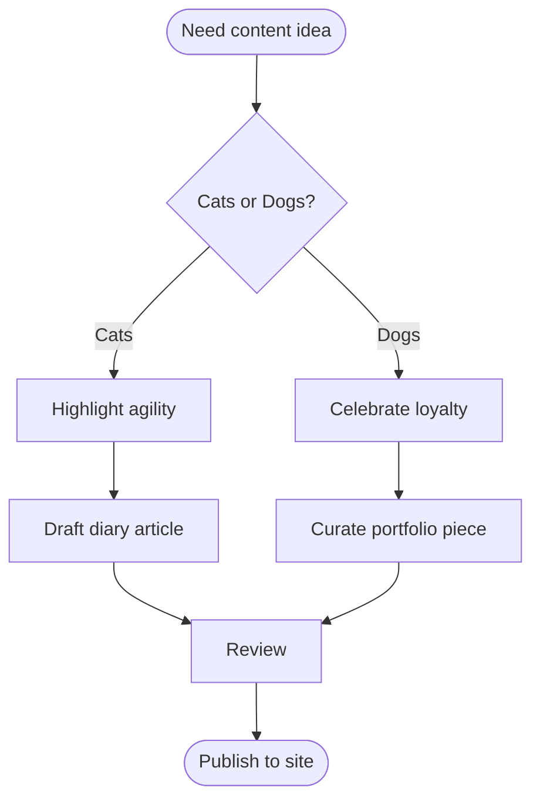

# Cats vs Dogs Studio











```mermaid
flowchart LR
    subgraph Visitor
        V1[Browse sections]
        V2[Search "Cat vs Dog"]
    end
    subgraph Frontend
        F1[Render Mediator layout]
        F2[Load SimpleJekyllSearch]
    end
    subgraph Backend
        B1[Serve static site from GitHub Pages]
        B2[Build via GitHub Actions + Jekyll]
    end

    V1 --> F1 --> B1
    V2 --> F2 --> B1
    B2 --> B1
    F1 -.-> F2
```

Cats vs Dogs Studio is a demonstration Jekyll project that showcases the [Mediator theme](https://github.com/dirkfabisch/mediator) with sample content focused on the playful rivalry between feline and canine companions.

## Getting started

1. Install Ruby and Bundler.
2. Install dependencies:
   ```bash
   bundle install
   ```
3. Run the development server:
   ```bash
   bundle exec jekyll serve
   ```
4. Visit `http://localhost:4000` to browse the site.

## Content structure

- **Diary posts** live in [`_posts/`](./_posts) and use the `diary` category for filtering.
- **Portfolio pieces** live in [`_portfolio/`](./_portfolio) and surface on the [Portfolio page](./portfolio.md).
- **Search** is powered by [`search.json`](./search.json) and [`assets/js/search.js`](./assets/js/search.js) using SimpleJekyllSearch.

Update or extend the content by adding new Markdown files with front matter metadata that mirrors the existing examples.

## Deployment

This project is optimized for GitHub Pages:

- The [`github-pages`](./Gemfile) gem keeps dependencies aligned with the hosted service.
- [`_config.yml`](./_config.yml) enables the remote Mediator theme and standard plugins such as SEO, sitemap, and archives.
- [`.github/workflows/jekyll.yml`](./.github/workflows/jekyll.yml) builds and deploys the site through GitHub Actions. Enable Pages via **Settings → Pages**, choose **GitHub Actions**, and the workflow will publish `_site` whenever the `work` branch is updated.

Before the first deploy, set the correct `url` (and optional `baseurl`) in `_config.yml`, then push the repository to GitHub. Each successful workflow run updates the public site automatically.
